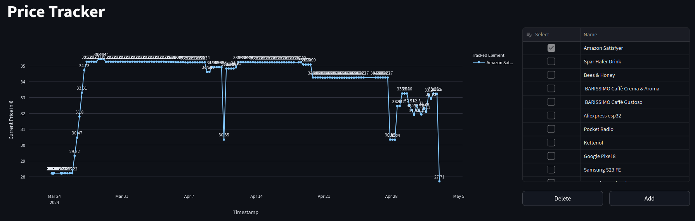

# PriceTracker

Python version used for development and testing: 3.11

### Collaborators:

- Carina Hauber
- Michael Duschek
- Lukas Seifriedsberger

## How to locally set-up and run

1. Make sure **Python 3.11** is installed
2. Install the requirements by executing `pip install -r requirements.txt`
3. Execute the streamlit webserver by executing `streamlit run price_tracker.py`
4. Visit the webserver at http://localhost:8501

## Project Description

This project operates a webserver that incorporates a webscraper to monitor various fields across internet websites. Its primary function is to track product prices from multiple online shops without focusing on any specific one. This approach presents several challenges:

- **User-Agent and Browser Emulation:** To access online shops, which typically block webcrawlers, the project emulates a specific user-agent and browser.
- **Field Selection:** The project utilizes X-PATH or CSS selectors to accurately identify the required price field.
- **Data Extraction and Storage:** It extracts the price using Regular Expressions (RegEx) from the HTML field and stores this data in a database.

### User Interface

A Streamlit dashboard serves as the user interface:

1. **Price Tracking Visualization:**
   - The dashboard features a line chart displaying the price history. Users can select one or multiple items to track and visualize their price trends over time.
   - Example visualization:
     

2. **Management Form:**
   - Users can add new items, modify existing ones, or delete them through a form. This form requires details such as the item name, the URL of the online shop, and either an X-PATH or CSS selector for the price field. Users can also set how frequently the price should be updated.

### Technical Aspects

**Webcrawler Configuration:**
- The crawler mimics the following user client to appear as a legitimate browser:
  `Mozilla/5.0 (Windows NT 10.0; Win64; x64) AppleWebKit/537.36 (KHTML, like Gecko) Chrome/121.0.0.0 Safari/537.3`
- It operates using instances of the Firefox browser, automatically navigating to specified URLs, loading pages, and extracting the desired values.
- The crawler can be set to run in a headless mode (no visible GUI) by uncommenting: `firefox_options.add_argument('--headless')`.

**Task Scheduler:**
- A task scheduler is integrated into the application that automatically initiates and manages crawling operations at predefined intervals.

**Troubleshooting Tips:**
- If online shops block the crawler, alternating between X-PATH and CSS selectors might resolve the issue.

## TODO:

- [x] Selenium Browser integration for a user to select HTML DOM element in question (e.g. Price)
- [ ] Web Scraper:
  - [x] Scrape Selected HTML DOM elemets in a predefined time peroid
  - [x] Error handling
  - [x] Mutithreading
  - [ ] Task planner/cronjobs for timing
- [ ] Sqlite Database:
  - [x] Tracked links with elements
  - [x] Price history for every crawl
  - [ ] Optional: multiple users
- [ ] Streamlit Dashboard:
  - [x] List of tracked items
  - [x] Price history per item
  - [ ] Tracking/Notification Settings
  - [ ] Optional: User Administration, User Creation, User Management
- [ ] Notification Module
  - [ ] Ideas: Browser notifications via Streamlit Dashboard Module, IFTTT, Email
- [ ] Security
  - [ ] Optional: User Authentication, Authorization
  - [ ] 2nd Option: Nginx Proxy Server
