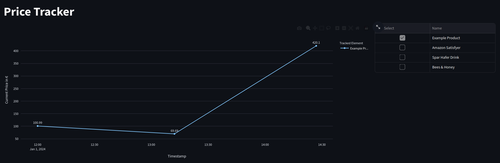

# PriceTracker
Python version used for development and testing: 3.

### Collaborators:
- Carina Hauber
- Michael Duschek
- Lukas Seifriedsberger

## Project Description
This project hosts a webserver that enables a user to track 
fields in websites all over the internet via a webscraper.

The main point of this project is tracking prices of various online-shops
without specializing on a specific one. This results in certain challenges:
- Emulating a certain user-agent and browser, as online-shops usually prohibit access by webcrawlers. 
- Finding the right field using X-PATH and CSS-selectors
- Extracting the actual price of the HTML field by using a RegEx and saving it in the database

For user interaction, a streamlit dashboard is launched.
It consists of a line chart where the user can select one or multiple tracked elements.
The price history of the selected elements is then plotted onto the chart. 

The second part of the dashboard provides a formular, where new items can be added 
and existing ones can be modified or deleted.
Here, the user has to provide a name, the url of the online-shop, an X-PATH or CSS-selector 
to the price field.
Additionally, the user can define an update interval and a min and max-price.
Lastly, there are sliders to acivate the tracked item and use the thresholds provided above 
to notify the user on exceeding them. 

[//]: # (<Image here>)

## Technical aspects
The crawler emulates following user client to trick most websites to believe it is a legit user:

`Mozilla/5.0 (Windows NT 10.0; Win64; x64) AppleWebKit/537.36 (KHTML, like Gecko) Chrome/121.0.0.0 Safari/537.3`

It creates instances of the Firefox Webbrowser where it automatically navigates to the provided url, 
loads the page and extracts the desired value.

By uncommenting the line `firefox_options.add_argument('--headless')`, no actual window will open.

The task scheduler for crawling-operations starts automatically with the application and executing the tasks 
according to their predefined interval.

Sometimes, web-shops still manage to deny service to the crawler. 
If this happens, changing from X-PATH to CSS selectors and vice versa is advised.

## TODO:
- Selenium Browser integration for a user to select HTML DOM element in question (e.g. Price)
- Web Scraper:
  - Scrape Selected HTML DOM elemets in a predefined time peroid
  - Error handling
  - Mutithreading
  - Task planner/cronjobs for timing
- Sqlite Database:
  - Tracked links with elements
  - Price history for every crawl
  - Optional: multiple users
- Streamlit Dashboard:
  - List of tracked items
  - Price history per item
  - Tracking/Notification Settings
  - Optional: User Administration, user Creation, User Management
- Notification Module
  - Ideas: Browser notifications via Streamlit Dashboard Module, IFTTT, Email
- Security
  - Optional: User Authentication, Authorization
  - 2nd Option: Nginx Proxy Server
